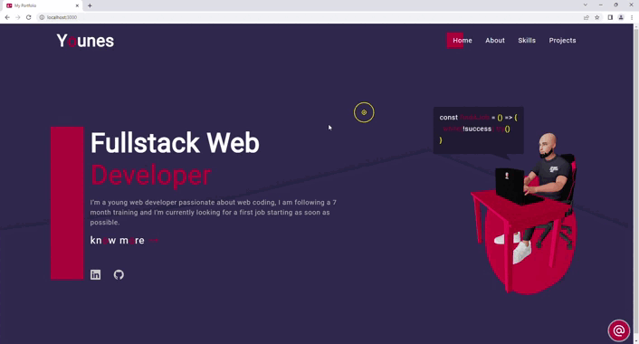

# My portfolio



## [ ----> [View demo](https://elmiriyounes.github.io/portfolio/) <---- ]

## About-the-project 🚀

This is my portfolio.

### 🛠 Built with

* 
* 
* 
* 

## ⚡️ Clone the repo

* Clone the repository:
    ```gitbash
    git clone git@github.com:ElmiriYounes/portfolio.git
    ```

* Install the packages (from the root folder):
    ```gitbash
    npm install
    ```

* Get started (from the root folder):
    ```gitbash
    npm start
    ```

## 💬 Contact

El miri younes - elmiri.younes@hotmail.com